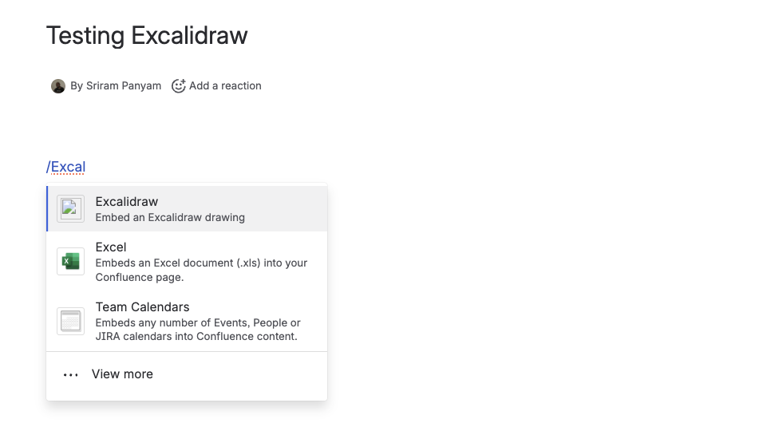
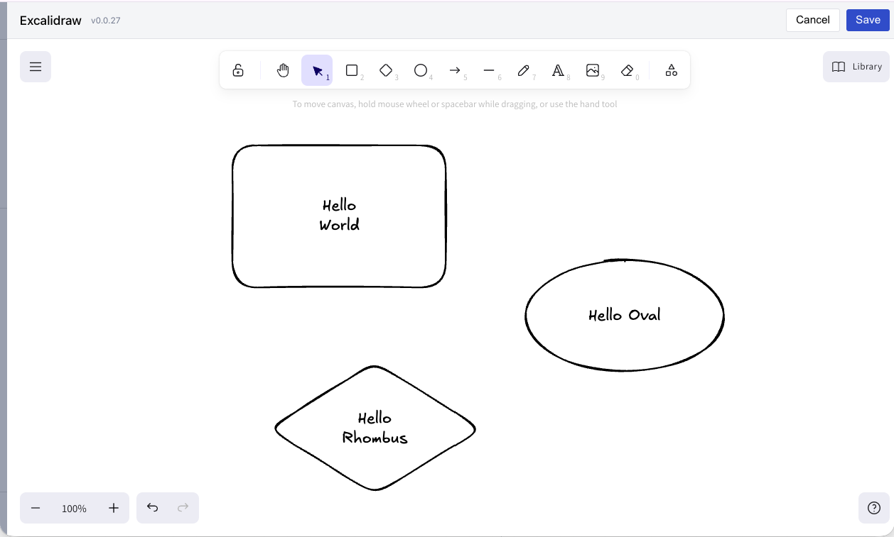
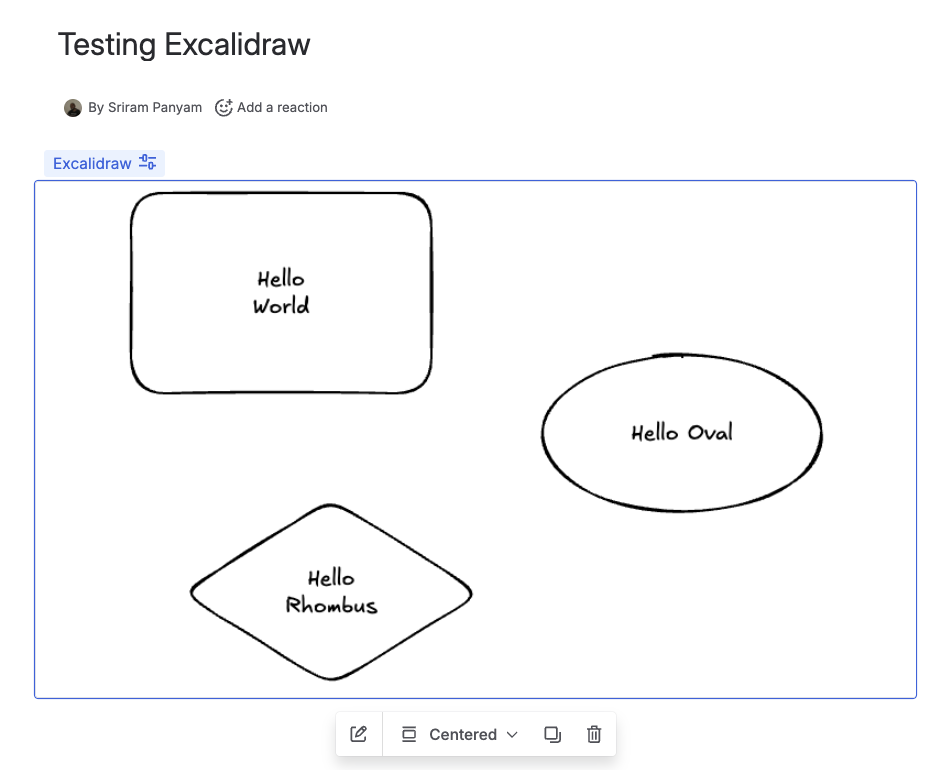

# Excaliframe

A Confluence Cloud app that lets you create and edit [Excalidraw](https://excalidraw.com/) drawings directly in Confluence pages. All drawing data is stored within Confluence - no external services required.

---

## TL;DR - Quick Install for Admins

> **Note:** This app is currently available in **development mode** only. It requires enabling development mode in your Confluence instance and is not yet listed on the Atlassian Marketplace.

**Install in under 2 minutes:**

1. Go to **Confluence Settings** → **Apps** → **Manage apps**
2. Click **Settings** (bottom of page) → Enable **development mode**
3. Click **Upload app** → Enter this URL:
   ```
   https://excaliframe.appspot.com/confluence/atlassian-connect.json
   ```
4. Done! Users can now type `/Excalidraw` in any page to insert a drawing.

> **Why no self-hosting needed?** The hosted version at `excaliframe.appspot.com` is just a static file server - **all your diagrams are stored in Confluence**, not on our server. You only need to self-host if your organization requires it.

---

## Screenshots

**Insert a drawing** - Type `/Excal` in the Confluence editor



**Edit with Excalidraw** - Full-featured drawing editor



**View on page** - Drawings render as PNG previews



## Features

- **Full Excalidraw Editor** - Complete drawing capabilities including shapes, text, arrows, freehand drawing, and more
- **Inline Viewer** - Drawings display as PNG previews directly on Confluence pages
- **Local Storage** - All data (JSON + PNG snapshots) stored in Confluence's content storage
- **No External Dependencies** - Excalidraw is bundled; works without external network access
- **Hot Reload Development** - Webpack dev middleware for instant changes during development

## Quick Start

```bash
# Install dependencies
npm install

# Start dev server with Cloudflare tunnel
make cloud-dev
```

Look for the tunnel URL in the output (e.g., `https://xxx.trycloudflare.com`), then:

1. Go to your Confluence Cloud instance → Settings → Apps → Manage apps
2. Enable development mode
3. Upload app using: `<tunnel-url>/confluence/atlassian-connect.json`

See [docs/CLOUD_SETUP.md](./docs/CLOUD_SETUP.md) for detailed instructions.

## Project Structure

```
excaliframe/
├── src/                        # Frontend (React + TypeScript)
│   ├── editor/                 # Excalidraw editor component
│   ├── renderer/               # Drawing viewer component
│   ├── utils/                  # Utilities (mockAP for dev)
│   └── types/                  # TypeScript declarations
├── server/                     # Go backend (handler packages)
│   ├── confluence/             # /confluence/* routes
│   ├── excalidraw/             # /excalidraw/* routes
│   └── middleware/             # HTTP middleware
├── dist/                       # Build output (generated)
│   ├── excalidraw/             # Excalidraw HTML pages
│   ├── static/excalidraw/      # JS bundles (served by GAE/CDN)
│   └── images/                 # Static images
├── main.go                     # Go server entry point
├── go.mod                      # Go module definition
├── webpack.config.js           # Frontend build config
├── atlassian-connect.json      # Confluence Connect descriptor
├── app.yaml                    # Google App Engine config
├── Makefile                    # Build commands
└── package.json                # Frontend dependencies
```

## Development

### Commands

| Command | Description |
|---------|-------------|
| `make cloud-dev` | Start dev server with hot reload + tunnel |
| `make dev` | Start dev server with hot reload (no tunnel) |
| `make dev-tunnel` | Start tunnel separately (use with `make dev`) |
| `make build` | Build for production |
| `make help` | Show all available commands |

### Hot Reload Development

For the fastest development experience:

```bash
# All-in-one: dev server + tunnel
make cloud-dev

# Or run separately in two terminals:
make dev          # Terminal 1: dev server with hot reload
make dev-tunnel   # Terminal 2: cloudflare tunnel
```

Changes to files in `src/` will automatically rebuild and refresh.

## How It Works

### Architecture

```
┌─────────────────────────────────────────────────────────────┐
│                     Confluence Page                         │
│  ┌────────────────────────────────────────────────────────┐ │
│  │                   Excalidraw Macro                     │ │
│  │  ┌──────────────────────────────────────────────────┐  │ │
│  │  │              iframe (renderer.html)              │  │ │
│  │  │           PNG Preview of Drawing                 │  │ │
│  │  └──────────────────────────────────────────────────┘  │ │
│  └────────────────────────────────────────────────────────┘ │
└─────────────────────────────────────────────────────────────┘
                              │
                              │ Edit Macro
                              ▼
┌─────────────────────────────────────────────────────────────┐
│                    Macro Editor Dialog                      │
│  ┌────────────────────────────────────────────────────────┐ │
│  │               iframe (editor.html)                     │ │
│  │              Full Excalidraw Editor                    │ │
│  └────────────────────────────────────────────────────────┘ │
└─────────────────────────────────────────────────────────────┘
```

### Data Flow

1. **Insert Macro** - User inserts "Excalidraw" macro from the Confluence editor
2. **Edit** - Confluence loads `editor.html` in a fullscreen dialog iframe
3. **Draw** - User creates drawing using Excalidraw (runs entirely client-side)
4. **Save** - Drawing JSON + PNG preview saved to macro body via `AP.confluence.saveMacro()`
5. **View** - On page load, `renderer.html` displays the PNG preview
6. **Re-edit** - Clicking edit loads the JSON back into Excalidraw

### Storage Format

Drawings are stored as JSON in the macro body:

```json
{
  "drawing": "{\"type\":\"excalidraw\",\"version\":2,\"elements\":[...],\"appState\":{...}}",
  "preview": "data:image/png;base64,..."
}
```

### Why a Server?

Confluence Connect requires a server to serve the app descriptor and HTML files, even though Excalidraw runs entirely client-side. See [docs/WHY_SERVER.md](./docs/WHY_SERVER.md) for details.

## Deployment

### Google App Engine (Production)

```bash
make gae-deploy
```

This builds, updates `baseUrl`, and deploys. Install in Confluence using:
`https://excaliframe.appspot.com/confluence/atlassian-connect.json`

### Other Platforms

The app can be deployed to any platform that can run a Go binary or Docker container:
- **Railway** - Connect GitHub repo (auto-detects Go)
- **Render** - Connect GitHub repo
- **Fly.io** - `fly deploy`
- **VPS** - Single binary + systemd, or Docker

See [docs/DEPLOYMENT.md](./docs/DEPLOYMENT.md) for detailed instructions.

## Documentation

| Document | Description |
|----------|-------------|
| [docs/FAQ.md](./docs/FAQ.md) | Enterprise FAQ - security, compliance, deployment, justification |
| [SECURITY_ROADMAP.md](./SECURITY_ROADMAP.md) | Security validation roadmap for enterprise readiness |
| [docs/CLOUD_SETUP.md](./docs/CLOUD_SETUP.md) | Confluence Cloud setup with tunnels |
| [docs/DEPLOYMENT.md](./docs/DEPLOYMENT.md) | Production deployment options |
| [docs/TESTING.md](./docs/TESTING.md) | Testing strategies |
| [docs/WHY_SERVER.md](./docs/WHY_SERVER.md) | Why Confluence Connect needs a server |

## Troubleshooting

**Port 3000 in use?**
```bash
make stop    # Stop any existing process
make start   # Restart the server
```

**Changes not reflecting?**
- Use `make cloud-dev` for hot reload during development
- In production, rebuild with `make build`

**Tunnel URL changed?**
- Run `make cloud-url` to see the current URL
- Re-install the app in Confluence with the new URL

## Tech Stack

- **Frontend**: React 18, Excalidraw 0.18, TypeScript
- **Backend**: Go 1.24 (stateless HTTP server)
- **Build**: Webpack 5 (frontend), Go compiler (backend)
- **Infrastructure**: Docker, Docker Compose
- **Deployment**: Google App Engine (Go runtime), or any platform

## License

MIT
