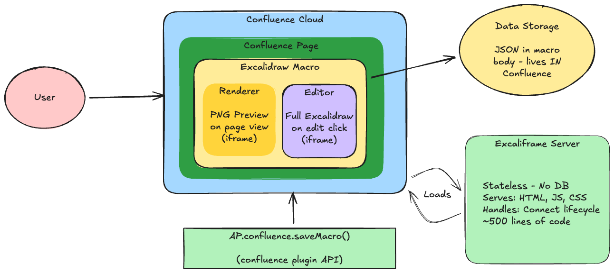

# Excaliframe Integration FAQ

A comprehensive guide for teams evaluating or implementing Excaliframe in their organization.

---

## Table of Contents

- [What is Excaliframe?](#what-is-excaliframe)
- [Business Justification](#business-justification)
- [Technical Questions](#technical-questions)
- [Security & Compliance](#security--compliance)
- [Implementation Guide](#implementation-guide)
- [Success Planning](#success-planning)
- [Common Concerns](#common-concerns)

---

## What is Excaliframe?

### Q: What is Excaliframe?

Excaliframe is a Confluence Cloud integration that embeds [Excalidraw](https://excalidraw.com)—an open-source whiteboarding and diagramming tool—directly into Confluence pages as a native macro. Users can create, edit, and share diagrams without leaving Confluence.

### Q: What is Excalidraw?

Excalidraw is a popular open-source virtual whiteboard with a hand-drawn aesthetic. It's widely used for:
- Architecture diagrams
- Flowcharts and process maps
- Wireframes and mockups
- Technical illustrations
- Brainstorming and ideation

### Q: How does it integrate with Confluence?

Excaliframe is an Atlassian Forge app that provides a "dynamic content macro." When users type `/Excalidraw` in a Confluence page, they can:
1. Create a new diagram in a full-screen editor
2. Save the diagram directly to the page
3. View a PNG preview on the published page
4. Click to edit anytime

### Q: Where is my data stored?

**All diagram data is stored within Confluence**—in the macro body of the page. Excaliframe's server is stateless and does not store any user data. Your diagrams inherit Confluence's storage, backup, and retention policies.

### Q: Why can't I just use Excalidraw.com directly?

Excalidraw.com is a standalone web application that doesn't integrate with Confluence. Here's why Excaliframe is needed:

| Without Excaliframe | With Excaliframe |
|---------------------|------------------|
| Create diagram at excalidraw.com | Create diagram directly in Confluence |
| Export as PNG/SVG | Save natively to page |
| Upload image to Confluence page | Stored in macro body automatically |
| To edit: download source, open in Excalidraw, edit, re-export, re-upload | Click "Edit" and make changes |
| No permission integration | Inherits Confluence page permissions |
| Diagrams stored in browser localStorage or local files | Diagrams stored in Confluence with backup/versioning |

**Excaliframe is the integration layer** that makes Excalidraw work as a native Confluence macro. It runs as a Forge app — Atlassian hosts everything, no separate server required.

### Q: What makes Excalidraw great for documentation?

Excalidraw's hand-drawn aesthetic is intentionally "imperfect"—this is a feature, not a bug:

- **Encourages rapid iteration**: No pressure for pixel-perfect diagrams means faster sketching
- **Signals "work in progress"**: Hand-drawn style communicates that diagrams can evolve
- **Reduces bikeshedding**: Less focus on visual polish, more focus on content
- **Fast to create**: Simple shapes and connectors, no complex formatting options

This makes it ideal for architecture diagrams, flowcharts, and technical documentation where clarity matters more than polish.

---

## Business Justification

### Q: Why should my organization use Excaliframe?

| Benefit | Description |
|---------|-------------|
| **Speed-first diagramming** | Excalidraw is built for rapid iteration - quick in, sketch, save, back to work |
| **Minimal context switching** | Lightweight UI means less mental overhead than full-featured tools |
| **Data stays in Confluence** | All diagram data stored in page content, no external storage |
| **Supports existing users** | Engineers already using Excalidraw manually get native integration |
| **Version history** | Diagram changes tracked via Confluence page history |
| **Zero cost** | Open-source, no per-user licensing |

### Q: How does Excaliframe complement existing tools?

Excaliframe is **additive** - it doesn't replace tools like Lucidchart. Different tools serve different needs:

| Use Case | Best Tool |
|----------|-----------|
| Quick architecture sketch | Excaliframe |
| Formal org chart | Lucidchart |
| Design discussion diagram | Excaliframe |
| Client-facing presentation | Lucidchart |
| Debug notes with visuals | Excaliframe |
| Detailed flowchart with swim lanes | Lucidchart |

### Q: What problem does this solve?

**The Gap:**
- Engineers often need quick, iterative diagrams for working documentation
- Full-featured tools can feel heavyweight for "I just need a quick box-and-arrow"
- Many engineers already use Excalidraw.com and manually export/paste - losing source files

**How Excaliframe Helps:**
- Native integration for users who prefer Excalidraw's speed
- Source files preserved in Confluence (no more lost localStorage)
- Lightweight option for quick-iteration use cases
- Zero friction for the quick sketch workflow

### Q: How do I justify this to leadership?

**Key Talking Points:**
1. **Zero cost**: Open-source, no licensing fees
2. **Supports existing behavior**: Engineers already using Excalidraw get proper tooling
3. **Additive value**: Complements existing tools, doesn't replace them
4. **Data control**: All data stays in Confluence
5. **Low risk**: Minimal infrastructure, simple architecture

---

## Technical Questions

### Q: What are the system requirements?

**For Users:**
- Modern web browser (Chrome, Firefox, Safari, Edge)
- Confluence Cloud access
- No local installation required

**For Deployment:**
- Atlassian Forge CLI (`forge deploy`)
- Confluence Cloud (not Server/Data Center)

### Q: Does it work with Confluence Server or Data Center?

Currently, Excaliframe is designed for **Confluence Cloud** only. It uses the Atlassian Forge platform which is specific to Cloud.

### Q: What's the architecture?



*Yes, this diagram was made with Excalidraw. We practice what we preach.*

**Summary:**
- **Confluence Cloud** hosts the page with the Excalidraw macro
- **Renderer** (iframe) displays PNG preview when viewing the page
- **Editor** (iframe) loads full Excalidraw when editing
- **Data Storage** - JSON stored in Confluence macro body (not on Excaliframe server)
- **Forge Platform** - Atlassian hosts the static assets, no external server

### Q: How is Excaliframe deployed?

Excaliframe is deployed via the **Atlassian Forge CLI** (`forge deploy`). Atlassian hosts the app's static assets on their infrastructure. There is no separate server to deploy or maintain.

### Q: What data format is used?

Diagrams are stored as JSON in Excalidraw's native format:
```json
{
  "drawing": "{\"type\":\"excalidraw\",\"version\":2,\"elements\":[...]}",
  "preview": "data:image/png;base64,..."
}
```

This format is compatible with:
- Excalidraw.com (direct import/export)
- Excalidraw VS Code extension
- Other Excalidraw integrations

### Q: Can I export diagrams?

Yes, from within the editor you can:
- Copy diagram as PNG
- Copy diagram as SVG
- Export to Excalidraw JSON file
- Copy/paste between Excalidraw instances

---

## Security & Compliance

### Q: Where is diagram data stored?

**All diagram data is stored within Confluence**—specifically in the macro body of each page. The Excaliframe server is stateless and does not persist any user data.

### Q: Does Excaliframe access my Confluence data?

Excaliframe requests two scopes:
- **READ**: To load existing diagram data from the macro body
- **WRITE**: To save diagram data back to the macro body

It does not access other Confluence content, user data, or spaces.

### Q: How is authentication handled?

Excaliframe uses the **Atlassian Forge platform** for authentication. Forge handles all authentication and authorization — the app runs within Atlassian's sandboxed Custom UI iframe.

### Q: What about GDPR/privacy compliance?

- **No external data transfer**: Diagrams stay in Confluence
- **No user tracking**: Excaliframe doesn't collect user analytics
- **Data residency**: Inherits Confluence's data residency settings
- **Data deletion**: Diagram deletion follows Confluence page deletion

### Q: What permissions does Excaliframe need?

| Permission | Purpose | Required |
|------------|---------|----------|
| READ | Load diagram data from macro body | Yes |
| WRITE | Save diagram data to macro body | Yes |
| User identity | Not requested | N/A |
| Space admin | Not requested | N/A |

### Q: What's the trust model? (Important for security review)

Be explicit about what you're trusting when using Excaliframe:

```
User Browser                    Confluence Cloud (Forge)
     │                                │
     │ ──── Views/Edits page ───────► │
     │                                │ ── Loads Custom UI iframe ──►  (Forge-hosted assets)
     │ ◄─────────────────────────────── Serves HTML/JS/CSS
     │                                │
     │ ── @forge/bridge save ────────►│  (Data saved TO Confluence macro config)
     │                                │
     │  All data stays within Confluence/Atlassian infrastructure
```

Forge hosts Excaliframe's static assets on Atlassian infrastructure. Diagram data flows between browser and Confluence via the `@forge/bridge` API. There is no external server.

**However**, the JavaScript runs in your browser and has access to diagram data (it must, to render/edit). This means you're trusting:

| Trust Layer | What You're Trusting | Verifiable? |
|-------------|---------------------|-------------|
| Confluence/Atlassian | Platform security, data storage | SOC2, compliance docs |
| Excaliframe code | ~300 lines don't exfiltrate data | Yes - code audit |
| Excalidraw library | Open-source library is safe | Partially - widely used |
| npm dependencies | Transitive dependencies are safe | Partially - `npm audit` |

**This trust model applies to ANY browser-based app** - Lucidchart, draw.io, Miro, or any Confluence Forge/Connect app.

### Q: How can I verify Excaliframe doesn't exfiltrate data?

**Code audit** - The Excaliframe source contains:
- ✅ No `fetch()` or `XMLHttpRequest` calls sending data externally
- ✅ No `WebSocket` connections
- ✅ No `navigator.sendBeacon()` calls
- ✅ Only `navigator.clipboard` usage (user-initiated copy/paste)

**Network monitoring** - During pilot, use browser DevTools to verify:
- Only asset requests to Excaliframe server (HTML, JS, CSS)
- Only API calls to Confluence (`@forge/bridge` methods)
- No POST/PUT requests with diagram data to external endpoints

### Q: What are the real security risks?

| Risk | Reality |
|------|---------|
| Data stored on Excaliframe server | **False** - stateless, no database |
| Excaliframe can read diagrams | **Partially true** - JS has access, but doesn't transmit (verifiable) |
| Unauthorized access | **Mitigated** - inherits Confluence permissions |
| Malicious code injection | **Primary risk** - mitigate with code audit + dependency scanning |
| Supply chain attack | **Real risk** - mitigate with dependency scanning, version pinning |

### Q: What security controls are recommended?

| Control | Purpose | Effort |
|---------|---------|--------|
| Deploy via Forge CLI | Assets hosted by Atlassian, no separate infrastructure | Low |
| Code audit | Verify no data exfiltration (~300 lines) | Low |
| Dependency scanning | Monitor npm packages for vulnerabilities | Low |
| Network monitoring during pilot | Verify no unexpected external requests | Low |
| Pin dependency versions | Prevent supply chain surprises | Low |

### Q: How does this compare to other tools?

| Tool | JS has data access? | Can audit code? | Data storage |
|------|---------------------|-----------------|--------------|
| Excaliframe | Yes | Yes (~300 lines) | Confluence only |
| Lucidchart | Yes | No (proprietary) | Lucidchart servers |
| draw.io | Yes | Partially | Configurable |
| Miro | Yes | No (proprietary) | Miro servers |

Excaliframe's advantage: small auditable codebase + data stays in Confluence.

---

## Implementation Guide

### Q: How do I set up Excaliframe?

**Option 1: Atlassian Marketplace (Recommended)**
1. Navigate to Confluence Settings → Find new apps
2. Search for "Excaliframe"
3. Click Install
4. Approve requested permissions

**Option 2: Forge CLI (Private Deployment)**
1. Clone the Excaliframe repository
2. Run `forge register` to register a new Forge app
3. Run `make deploy` to build and deploy
4. Run `make install-app` to install on your Confluence site

### Q: What's the recommended rollout plan?

```
Phase 1: Initial Setup (Days)
├── Security review (stateless app, minimal surface area)
├── Install using public endpoint
└── Test in sandbox

Phase 2: Pilot (2-4 weeks)
├── Enable for pilot team (engineers already using Excalidraw)
├── Brief announcement with quick-start guide
├── Gather feedback
└── Address any issues

Phase 3: Broader Rollout (1-2 weeks)
├── Enable organization-wide
├── Announce availability
└── Monitor adoption

Phase 4: Internal Hosting (When Ready)
├── Deploy to company infrastructure
├── Update Confluence app to internal endpoint
└── Full control over availability
```

**Note**: Starting with the public endpoint allows fast validation. Migration to internal hosting can happen after proving value.

### Q: What teams should be involved?

| Team | Role |
|------|------|
| IT/Platform | Installation, Confluence administration |
| Security | App review and approval |
| Engineering | Primary users, pilot participants |
| Documentation | User guides, best practices |
| Procurement | Marketplace purchase (if applicable) |

### Q: How do I train users?

**Recommended Approach:**
1. **Quick-start guide** (5 min read): Basic create/edit/save workflow
2. **Video walkthrough** (10 min): Common use cases
3. **Office hours** (optional): Drop-in Q&A for first 2 weeks
4. **Self-service**: Link to Excalidraw's documentation

Most users are productive within 5-10 minutes due to Excalidraw's intuitive interface.

---

## Success Planning

### Q: How do I measure success?

**Adoption Metrics:**
- Number of pages with Excalidraw diagrams
- Number of unique users creating diagrams
- Diagram edit frequency (via page history)

**Efficiency Metrics:**
- Reduction in external tool usage
- Time to create/update diagrams (survey)
- User satisfaction scores

**Quality Metrics:**
- Freshness of documentation diagrams
- Support ticket volume for diagramming

### Q: What are reasonable success criteria?

| Timeframe | Target |
|-----------|--------|
| 1 month | 20% of pilot team using regularly |
| 3 months | 50% of target users have created a diagram |
| 6 months | 30% reduction in external diagramming tools |
| 12 months | Standard tool for technical documentation |

### Q: What does testing look like?

**Technical Testing:**
- [ ] Installation completes without errors
- [ ] Create, edit, save diagram works
- [ ] Diagram persists across page reloads
- [ ] Large diagrams (100+ elements) render properly
- [ ] Works in supported browsers

**User Acceptance Testing:**
- [ ] Users can create diagram without assistance
- [ ] Users can edit existing diagrams
- [ ] Export/import functionality works
- [ ] No data loss on save

---

## Common Concerns

### Q: What if Excaliframe goes down?

- **View mode**: Diagrams render as PNG previews, so pages remain readable
- **Edit mode**: Temporarily unavailable until service restored
- **Data safety**: All data is in Confluence—no data loss risk
- **Self-hosting**: Full control over uptime if you deploy yourself

### Q: What are the limitations vs. other tools?

| Feature | Excaliframe | Lucidchart | Visio |
|---------|-------------|------------|-------|
| Hand-drawn aesthetic | ✅ Native | ❌ No | ❌ No |
| Real-time collaboration | ❌ No | ✅ Yes | ⚠️ Limited |
| Templates library | ⚠️ Limited | ✅ Extensive | ✅ Extensive |
| Shape libraries | ⚠️ Basic | ✅ Extensive | ✅ Extensive |
| Auto-layout | ❌ No | ✅ Yes | ✅ Yes |
| Data-linked diagrams | ❌ No | ✅ Yes | ✅ Yes |
| Cost | ✅ Free | ❌ Paid | ❌ Paid |
| Data in Confluence | ✅ Yes | ❌ External | ❌ External |

**Best for**: Architecture diagrams, flowcharts, wireframes, sketches, informal diagrams
**Less suited for**: Complex org charts, data-driven diagrams, formal engineering drawings

### Q: What if users resist the change?

**Mitigation Strategies:**
1. **Don't force migration**: Allow existing tools for specialized needs
2. **Start with enthusiasts**: Pilot with teams already using Excalidraw
3. **Show value quickly**: Demo time savings in first training
4. **Create champions**: Identify power users to help others

### Q: What are the technical risks?

| Risk | Likelihood | Mitigation |
|------|------------|------------|
| Performance with large diagrams | Low | Document size guidelines |
| Browser compatibility | Low | Test on supported browsers |
| Service downtime | Low | Self-host for full control; PNG fallback |
| Breaking changes | Low | Test updates in sandbox first |

### Q: What support is available?

- **Documentation**: This FAQ, setup guides, architecture docs
- **Community**: GitHub issues, Excalidraw community
- **Self-service**: Excalidraw's own documentation and tutorials
- **Source code**: Fully auditable, forkable if needed

---

## Quick Reference

### Deployment Checklist

- [ ] Security team has reviewed the integration
- [ ] Deployment method selected (Marketplace or Forge CLI)
- [ ] Sandbox testing completed
- [ ] Pilot team identified
- [ ] User documentation prepared
- [ ] Support process defined
- [ ] Success metrics established
- [ ] Rollout communication drafted

### Key URLs

| Resource | URL |
|----------|-----|
| Excalidraw | https://excalidraw.com |
| Excalidraw GitHub | https://github.com/excalidraw/excalidraw |
| Excaliframe GitHub | https://github.com/[your-org]/excaliframe |
| Atlassian Forge Docs | https://developer.atlassian.com/platform/forge/ |

### Support Contacts

| Issue Type | Contact |
|------------|---------|
| Installation/Setup | IT Help Desk |
| Usage Questions | [Internal Slack/Teams channel] |
| Bug Reports | GitHub Issues |
| Feature Requests | GitHub Discussions |

---

## Template: Internal Justification Document

Copy and customize this template for your organization:

```markdown
# Excaliframe Integration Proposal

## Executive Summary
Add Excaliframe to provide a lightweight, speed-first diagramming option in Confluence alongside existing tools.

## The Gap
- Engineers need quick-iteration diagrams for working documentation
- Some users already use Excalidraw manually (export/paste workflow)
- No native option for fast, sketch-style diagrams in Confluence

## What Excaliframe Provides
- Native Excalidraw integration as a Confluence macro
- Speed-first diagramming for quick architecture sketches, design discussions, debug notes
- Source files preserved in Confluence (vs. lost localStorage)
- Complements existing tools - users choose the right tool for each task

## Cost & Risk
- Zero licensing cost (open-source)
- No separate infrastructure (Forge-hosted)
- All data stays in Confluence
- Low risk: small auditable codebase, no external server

## Recommendation
Add Excaliframe as an option for users who prefer lightweight diagramming.

## Next Steps
1. Security review
2. Sandbox deployment
3. Pilot with interested team
4. Make available organization-wide
```

---

## Still Have Questions?

- Check the [main documentation](../README.md)
- Review the [architecture guide](./WHY_SERVER.md)
- Open an issue on GitHub
- Ask in your organization's support channel
